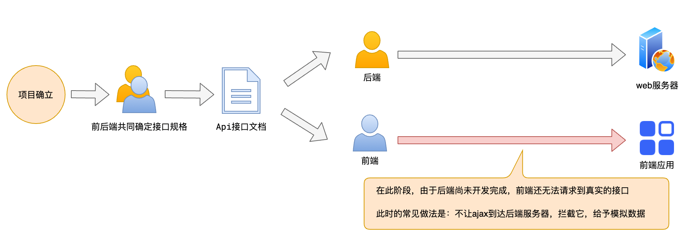
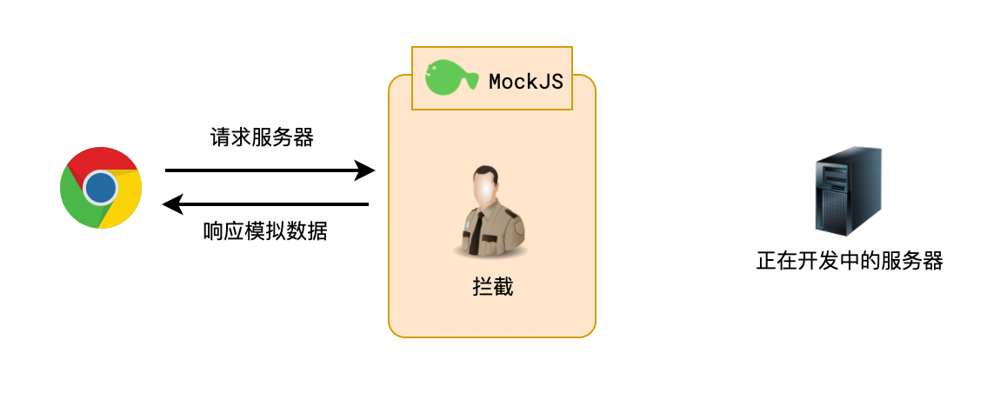
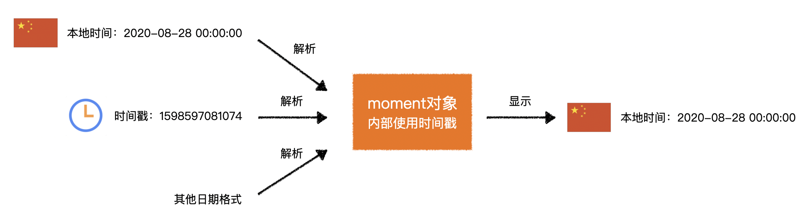

# 第三方库概览

## 官网下载使用

| 名称 | 文档 | 一句话介绍 |
| --- | --- | --- |
| jQuery | 官网：https://jquery.com/<br>中文网：https://jquery.cuishifeng.cn/ | 让操作 DOM 变得更容易 |
| Lodash | 官网：https://lodash.com/docs<br>中文网：https://www.lodashjs.com/ | 你能想到的工具函数它都帮你写了 |
| Animate.css | 官网：https://animate.style/ | 常见的 CSS 动画效果都帮你写好了 |
| Axios | 官网：https://axios-http.com/zh/ | 让网络请求变得更简单 |
| MockJS | 官网：http://mockjs.com/ | ajax 拦截和模拟数据生成 |
| Moment | 官网：https://momentjs.com/<br>中文网：http://momentjs.cn/ | 让日期处理更容易 |
| ECharts | 官网：https://echarts.apache.org/zh | 搞定所有你能想到的图表 |
| animejs | 官网：https://animejs.com/ | 简单好用的 JS 动画库 |
| editormd | 官网：https://pandao.github.io/editor.md | markdown 编辑器 |
| validate | 官网：http://validatejs.org/ | 简单好用的 JS 对象验证库 |
| date-fns | 官网：https://date-fns.org/ | 功能和 Moment 几乎相同，支持 tree shaking |
| zepto | 官网：https://zeptojs.com/ | 功能和 jQuery 几乎相同，对移动端支持更好，包体积更小 |
| nprogress | 官网：https://github.com/rstacruz/nprogress | 简单好用的进度条插件，YouTube 就使用的是它 |
| qs | 官网：https://github.com/ljharb/qs | 一个用于解析 url 的小工具 |

## CDN 在线使用

CDN 称之为内容分发网络（Content Delivery Network）。
提供很多的服务器，用户访问时，自动就近选择服务器给用户提供资源。

国内广泛使用的免费 CDN 站点：https://www.bootcdn.cn/

# jQuery

官网：https://jquery.com/

中文网：https://jquery.cuishifeng.cn/

CDN：https://cdn.bootcdn.net/ajax/libs/jquery/3.6.0/jquery.min.js

针对 DOM 的操作：

- 获取
- 创建
- 监听
- 改变

jQuery 可以让上面整个过程更加轻松。

##  jQuery 函数

jQuery 提供了一个函数，名称为 jQuery，也可以写作 `$`。
该函数提供了强大的 DOM 控制能力。

```js
// 获取类样式为 container 的所有 DOM
const container = $(".container");

// 获取 container 后面的兄弟元素，元素类样式必须包含 list
container.nextAll(".list");

// 删除元素
container.remove();

// 找到所有类样式为 list 元素的后代 li 元素，给它们加上类样式 item
$(".list li").addClass("item");

// 为所有 p 元素添加一些 style
$("p").css({ color: "#ff0011", background: "blue" });

// 注册 DOMContentLoaded 事件
$(function () {
  // ...
});

// 给所有 li 元素注册点击事件
$("li").click(function () {
  // ...
});

// 创建一个 a 元素，设置其内容为 link，然后将它作为子元素追加到类样式为 .list 的元素中
$("<a>").text("link").appendTo(".list");
```

## jQuery 对象和 DOM 对象

通过 jQuery 得到的元素是一个 jQuery 对象，而不是传统的 DOM。
jQuery 对象是一个伪数组。
jQuery 对象和 DOM 之间可以互相转换。

```js
// jQuery -> DOM
jQuery对象[索引];
jQuery对象.get(索引);

// DOM -> jQuery
$(DOM对象);
```

## 官网文档中的目录

| 目录名 | 内容 |
| --- | --- |
| 选择器 | 选择器是一个字符串，用于描述要选中哪些元素 |
| 筛选 | 在当前 jQuery 对象的基础上，进一步选中元素 |
| 文档处理 | 更改 HTML 文档结构<br>删除元素、清空元素内容、改变元素之间的关系 |
| 属性 | 控制元素属性<br>修改类样式、读取和设置文本框的 value、读取和设置 img 的 src |
| css | 控制元素 style 样式<br>改变字体颜色、设置背景、获取元素尺寸、获取和设置滚动位置 |
| 事件 | 监听元素的事件<br>监听文档加载完成、监听元素被点击 |
| ajax | jQuery 封装了 XHR，使 ajax 访问更加方便<br>这部分功能目前已被其他第三方库全面超越 |

## prop 和 attr 的区别

```html
<div>
  <a href="//channel.id/a.html"></a>
  <input type="checkbox" />
</div>
```

### 1）prop

相当于 `dom.xxx`。
获取的是 DOM 对象的内置属性。

```js
let a = $("a")[0];
a.href; // https://channel.id/a.html
$(a).prop("href"); // https://channel.id/a.html

let b = $(":checkbox")[0];
b.checked; // false
$(b).prop("checked"); // false
```

### 2）attr

相当于 `dom.getAttribute(xxx)`。
获取的是 DOM 元素上的自定义属性。
标签上的值是什么，获取到的就是什么。

```js
let a = $("a")[0];
a.getAttribute("href"); // "//channel.id/a.html"
$(a).attr("href"); // "//channel.id/a.html"

let b = $(":checkbox")[0];
b.getAttribute("checked"); // null
$(b).attr("checked"); // null
```

# Lodash

官网：https://lodash.com/docs

中文网：https://www.lodashjs.com/

CDN：https://cdn.bootcdn.net/ajax/libs/lodash.js/4.17.21/lodash.min.js

Lodash 是一个针对 ES 的古老工具库，出现在 ES5 之前。
Lodash 提供了大量的 API，弥补了 ES 中对象、函数、数组 API 不足的问题。
大部分工具函数，都可以在 Lodash 中找到。
一般用于编写框架或通用库。

# Animate.css

官网：https://animate.style/

CDN：https://cdn.bootcdn.net/ajax/libs/animate.css/4.1.1/animate.min.css

Animate.css 库提供了大量的动画效果。
开发者仅需使用它提供的类名即可。

> 注意：Animate.css 中的动画对行盒无效。

## 基本使用

### 1）类名格式

`animate__animated animate__效果名`

### 2）效果名

分为以下几个大类，可以从官网中找到对应的分类。
每个分类下有多种效果名可供使用。

| 分类 | 含义 |
| --- | --- |
| Attention seekers | 强调 |
| Back entrances | 进入 |
| Back exits | 退出 |
| Bouncing entrances | 弹跳进入 |
| Bouncing exits | 弹跳退出 |
| Fading entrances | 淡入 |
| Fading exits | 淡出 |
| Flippers | 翻转 |
| Lightspeed | 光速 |
| Rotating entrances | 旋转进入 |
| Rotating exits | 旋转退出 |
| Specials | 特殊效果 |
| Zooming entrances | 缩放进入 |
| Zooming exits | 缩放退出 |
| Sliding entrances | 滑动进入 |
| Sliding exits | 滑动退出 |

## 工具类

Animate.css 还提供了多个工具类。
可以控制动画的延时、重复次数、速度。

### 1）延时

默认无延时。

```css
animate__delay-1s /* 延时1秒 */
animate__delay-2s /* 延时2秒 */
animate__delay-3s /* 延时3秒 */
animate__delay-4s /* 延时4秒 */
animate__delay-5s /* 延时5秒 */
```

### 2）重复次数

默认重复 1 次。

```css
animate__repeat-2 /* 重复2次 */
animate__repeat-3 /* 重复3次 */
animate__infinite /* 重复无限次 */
```

### 3）速度

默认 1 秒内完成动画。

```css
animate__slow /* 2秒内完成动画 */
animate__slower /* 3秒内完成动画 */
animate__fast /* 800毫秒内完成动画 */
animate__faster /* 500毫秒内完成动画 */
```

## 示例

```html
<!--
  使用 animate.css
  动画名：bounce
  速度：快
  重复：无限次
  延迟：1秒
-->
<h1
  class="
    animate__animated
    animate__bounce
    animate__fast
    animate__infinite
    animate__delay-1s
  "
>
  Hello Animate
</h1>
```

# Axios

官网：https://axios-http.com/zh/

CDN：https://cdn.bootcdn.net/ajax/libs/axios/0.21.1/axios.min.js

Axios 是一个请求库。
在浏览器环境中，封装了 XHR。
提供更加便捷的 API 发送请求。

## 1. 基本使用

### 1）格式

```js
axios.get(url地址, [请求配置]);
axios.post(url地址, [请求体对象], [请求配置]);

// 或直接使用 axios 方法，在请求配置中填写请求方法
axios(请求配置);
```

### 2）示例

```js
// 发送 get 请求到 https://study.duyiedu.com/api/herolist，输出响应体的内容
axios.get("https://study.duyiedu.com/api/herolist").then((resp) => {
  // resp.data 为响应体的数据，axios 会自动解析 JSON 格式
  console.log(resp.data);
});

// 发送 get 请求到 https://study.duyiedu.com/api/user/exists?loginId=abc，输出响应体的内容
axios
  .get("https://study.duyiedu.com/api/user/exists", {
    // 这里可以配置 query，axios 会自动将其进行 Url 编码
    params: {
      loginId: "abc",
    },
  })
  .then((resp) => {
    // resp.data 为响应体的数据，axios 会自动解析 JSON 格式
    console.log(resp.data);
  });

// 发送 post 请求到 https://study.duyiedu.com/api/user/reg，会将第二个参数转换为 JSON 格式的请求体
axios
  .post("https://study.duyiedu.com/api/user/reg", {
    loginId: "abc",
    loginPwd: "123123",
    nickname: "棒棒鸡",
  })
  .then((resp) => {
    // resp.data 为响应体的数据，axios 会自动解析 JSON 格式
    console.log(resp.data);
  });
```

## 2. 实例

axios 允许开发者先创建一个实例，后续通过使用实例进行请求。
可以预先进行某些配置。

```js
// 创建实例
const instance = axios.create({
  baseURL: "https://study.duyiedu.com/",
});

// 发送 get 请求到 https://study.duyiedu.com/api/herolist，输出响应体的内容
instance.get("/api/herolist").then((resp) => {
  // resp.data 为响应体的数据，axios 会自动解析 JSON 格式
  console.log(resp.data);
});
```

## 3. 拦截器

有时可能需要对所有的请求或响应做一些统一的处理。
在请求时，如果发现本地有 token，需要附带到请求头。
在拿到响应后，仅需要取响应体中的 data 属性。
如果发生错误，我们需要做一个弹窗显示。
这些统一的行为就非常适合使用拦截器。
设置好拦截器后，后续的请求和响应都会触发对应的函数。
拦截器可以针对 axios 实例进行设置。

### 1）添加请求拦截器

config 为当前的请求配置。
在发送请求之前做些什么。

```js
axios.interceptors.request.use(function (config) {
  const token = localStorage.getItem("token");
  if (token) {
    // 添加一个请求头
    config.headers.authorization = token;
  }
  // 返回处理后的配置
  return config;
});
```

### 2）添加响应拦截器

```js
axios.interceptors.response.use(
  function (resp) {
    // 2xx 范围内的状态码都会触发该函数，对响应数据做点什么

    // 仅得到响应体中的 data 属性
    return resp.data.data;
  },
  function (error) {
    // 超出 2xx 范围的状态码都会触发该函数，对响应错误做点什么

    // 弹出错误消息
    alert(error.message);
  },
);
```

# MockJS

官网：http://mockjs.com/

CDN：https://cdn.bootcdn.net/ajax/libs/Mock.js/1.0.0/mock-min.js

- 产生模拟数据
- 拦截 Ajax





## 仅模拟数据

数据模板有其特有的书写规范。
具体写法见官网。

```js
Mock.mock(数据模板);
```

## 拦截 + 模拟数据

更多用法见官网。

### 1）拦截

MockJS 拦截数据的原理是重写了 XHR。
因此仅能拦截 XHR 的数据请求，而无法拦截使用 fetch 发出的请求。

可以拦截：

- 原生 XmlHttpRequest
- jQuery 中的 $.ajax
- axios

```js
Mock.mock(要拦截的url, 要拦截的请求方法, 数据模板);
```

### 2）模拟网络延时

```js
// 网络延时400毫秒
Mock.setup({
  timeout: 400,
});

// 网络延时200-600毫秒
Mock.setup({
  timeout: "200-600",
});
```

# Moment

官网：https://momentjs.com/

中文网：http://momentjs.cn/

CDN：https://cdn.bootcdn.net/ajax/libs/moment.js/2.29.1/moment.min.js

各种语言包：https://www.bootcdn.cn/moment.js/

提供了强大的日期处理能力。

## 1. 时间基础知识

### 1）单位

| 单位 | 名称 | 换算 |
| --- | --- | --- |
| hour | 小时 | 1 day = 24 hours |
| minute | 分钟 | 1 hour = 60 minutes |
| second | 秒 | 1 minute = 60 seconds |
| millisecond(ms) | 毫秒 | 1 second = 1000 ms |
| nanosecond(ns) | 纳秒 | 1 ms = 1000 ns |

### 2）GMT 和 UTC

世界划分为 24 个时区，北京在东 8 区，格林威治在 0 时区。

- GMT：Greenwich Mean Time 格林威治世界时
  - 太阳时，精确到毫秒
- UTC：Universal Time Coordinated 世界协调时
  - 以原子时间为计时标准，精确到纳秒

国际标准中，已全面使用 UTC 时间，而不再使用 GMT 时间。

GMT 和 UTC 时间在文本表示格式上是一致的，均为 `星期缩写, 日期 月份 年份 时间 GMT`，如：`Thu, 27 Aug 2020 08:01:44 GMT`。

ISO 8601 标准规定，建议使用 `YYYY-MM-DDTHH:mm:ss.msZ` 表示时间，如：`2020-08-27T08:01:44.000Z`。

GMT、UTC、ISO 8601 都表示的是零时区的时间。

### 3）Unix 时间戳

Unix 时间戳（Unix Timestamp）是 Unix 系统最早提出的概念。
将 UTC 时间 1970 年 1 月 1 日凌晨作为起始时间，到指定时间经过的秒数（毫秒数）。

### 4）程序中的时间处理

程序对时间的计算、存储务必使用 UTC 时间，或者时间戳。
在和用户交互时，将 UTC 时间或时间戳转换为更加友好的文本。

## 2. Moment 的核心用法

- 获得 Moment 对象
- 针对 Moment 对象做各种操作



# ECharts

官网：https://echarts.apache.org/zh

CDN：https://cdn.bootcdn.net/ajax/libs/echarts/5.1.1/echarts.min.js

## 1. 使用地图需要两部分数据

- `.geojson` 格式的地理信息
  - 该信息将作为地图背景板
- 在地图背景板上要进行显示或交互的数据

## 2. 需要横纵轴的图表

配置了 `xAxis`，需要另外配置 `yAxis` 为空对象。
ECharts 会自动生成纵轴。
但是不配置该选项会报错。

```js
chart.setOption({
  title: {
    text: "ECharts 折线图",
  },
  tooltip: {}, // 不配置不会显示悬浮菜单
  legend: {
    data: ["手机销量", "平板销量"],
  },
  xAxis: {
    data: Array(12)
      .fill(0)
      .map((month) => `${month + 1}月`),
  },
  yAxis: {}, // 纵坐标让其自动生成，不配置会报错
});
```
